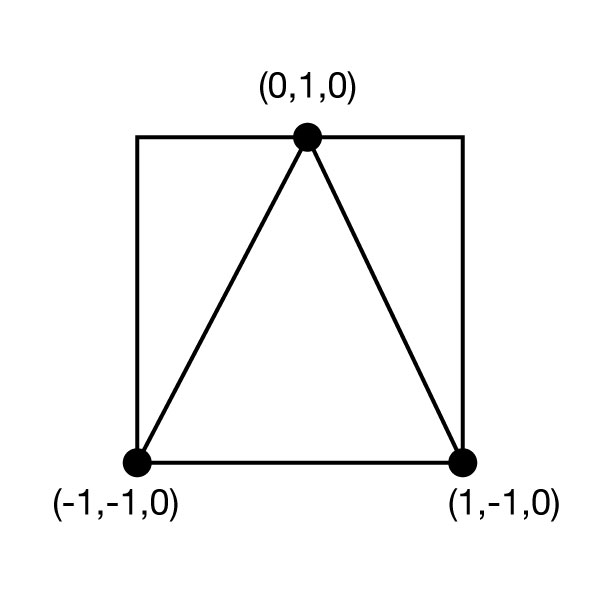
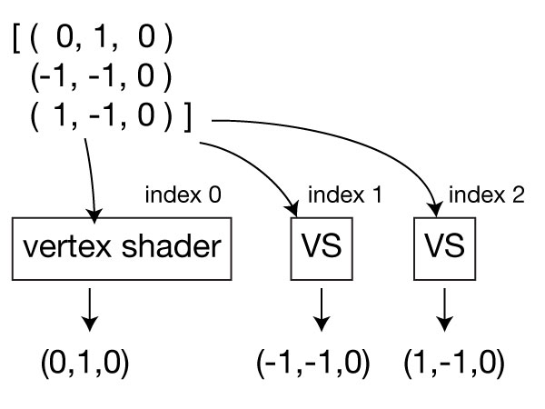
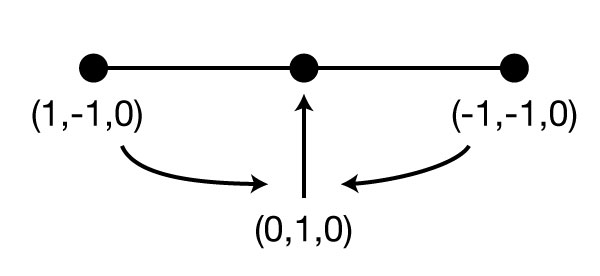
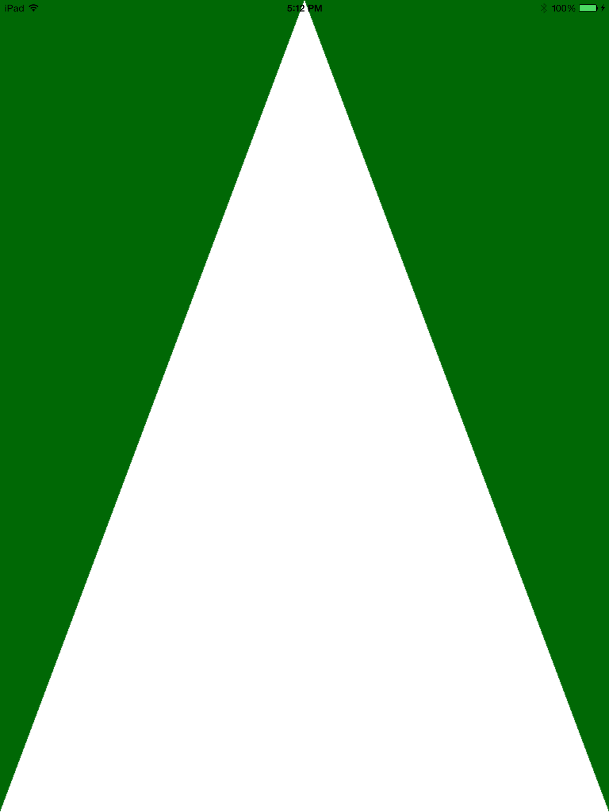

# iOS Metal教程第一课：从零开始
本文翻译自[ray wenderlich](https://www.raywenderlich.com)的Metal系列教程，[原文地址](https://www.raywenderlich.com/146414/metal-tutorial-swift-3-part-1-getting-started)。

&ensp;
本例通过一个简单的Xcode工程详细介绍以上过程。首先，你需要创建一个简单的iOS project，本系列教程选择使用swift.<br />
准备工作：
* Xcode 8 以上
* iOS 8 以上的真机设备
* Swift3.1


## Metal设置

本节内容将通过绘制一个简单的三角形的栗子来介绍Metal的具体使用步骤。<br />
在渲染之前需要通过以下7个步骤来设置Metal：
1. 创建一个MTLDevice
2. 创建一个CAMetalLayer
3. 创建一个顶点缓冲区（Vertex Buffer）
4. 创建一个顶点着色器（Vertex Shader）
5. 创建一个片元着色器（Fragment Shader）
6. 创建一个渲染管线（Render Pipeline）
7. 创建一个指令队列（Command Queue）
&ensp;
#### 1. 创建一个MTLDevice
MTLDevice是对设备GPU的引用，可以用来创建所有需要的Metal对象（指令队列、缓冲区、纹理等）。<br/>
具体代码：<br/>
a. 打开project中的 ==ViewController.swift== ，在文件头部引入Metal框架<br/>
`import Metal`<br/><br/>
b. 在 ==ViewController== 类中添加device属性<br />
`var device: MTLDevice!`<br />
这里声明为option类型，是因为实在 ==viewDidLoad()== 中而不是 init中初始化。另外由于我们确切的知道在使用之前能够初始化，所有使用!来隐式解包方便使用。<br /><br/>
c. 在 ==viewDidLoad()==中添加<br />
`device = MTLCreateSystemDefaultDevice()`<br />
返回设备上默认的GPU引用。<br /><br/>
#### 2. 创建一个CAMetalLayer
在iOS中，你所看见的任何东西都是绘制在 ==CALayer==上，同样的，如果你想使用Metal在屏幕上绘制任何东西，就需要使用 ==CALayer==的子类 ==CAMetalLayer==。<br/>
具体代码：<br/>
a. 添加layer<br/>
`var metalLayer: CAMetalLayer!`<br/>
b. 在 ==viewDidLoad()==中添加<br/>
```
metalLayer = CAMetalLayer()
metalLayer.device = device //device the layer use
metalLayer.pixelFormat = .bgra8Unorm //pixel format
metalLayer.framebufferOnly = true //
metalLayer.frame = view.layer.frame
view.layer.addSublayer(metalLayer)
```
&ensp;
#### 3. 创建一个顶点缓冲区
Metal中一切都是三角形，平面、3D图形都可以分解成一系列的三角形。<br/>
Metal使用标准坐标系，意味着设备屏幕就是一个长宽高(x,y,z)为2*2*1，中心点为(0,0,0.5)的立方体。假设z=0，那么(-1,-1,0)为左下角，(1,1,0)为右上角。如图所示：


具体代码：<br/>
a. 添加三角形顶点数据
```
let vertexData: [Float] = [
        0.0, 1.0, 0.0, //
        -1.0, -1.0, 0.0,
        1.0, -1.0, 0.0
    ]
```
上述代码的数据是在CPU中创建了一个数组，需要通过 ==MTLBuffer== 将数组发送到GPU才能使用Metal进行处理<br/>
b. 添加顶点缓冲区<br/>
`var vertexBuffer: MTLBuffer!`<br/>
c. 初始化缓冲区，在 ==viewDidLoad()==中添加<br/>
```
let bufferSize = vertexData.count * MemoryLayout.size(ofValue: vertexData[0])
vertexBuffer = device.makeBuffer(bytes: vertexData, length: bufferSize, options: [])
```
<br/><br/>
#### 4. 创建一个顶点着色器
着色器，简而言之，就是运行在GPU上的小程序，使用类似C++的==Metal Shading Language==编写，前面创建的顶点将作为着色器的输入。

每个顶点都会调用一次着色器，主要任务就是处理顶点信息（诸如位置、颜色、纹理坐标等），然后返回一个可能潜在修改过的位置，可能还带有其他数据。

本节内容为简单起见，着色器将原样返回输入顶点的位置。如图：


Talk is cheap，show me the code~<br/>
新建着色器文件:<br/>
xcode -> new file -> metal file -> shaders.metal<br/>
定义顶点着色器：<br/>
```
vertex float4 basic_vertex(   // 1
    const device packed_float3* vertex_array [[ buffer(0) ]], // 2
    unsigned int vid [[ vertex_id ]]) { // 3
    return float4(vertex_array[vid], 1.0) // 4
}
```
<br/>
代码解释：<br/>
line 1. 顶点着色器必须以关键字 ==vertex== 开头，函数必须返回顶点的最终位置，这里通过==float4==（4个float的向量），然后是着色器的名字，后续可以使用名字查找着色器。<br/>
line 2. 第一个参数是一个指向顶点位置数组的指针。==[[ ... ]]==语法用来声明用于指定附加信息，比如资源位置、着色器输入、内置变量的属性。这里使用==[[ buffer(0) ]]==来表示这个参数将位于传递给着色器的第一个缓冲区中。<br/>
line 3. vertex_id参数表示，被顶点数组的指定顶点填充。<br/>
line 4. 通过vertex_id在数组中查询顶点，然后将向量转为float4

<br/><br/>
#### 5. 创建一个片元着色器
片元着色器：屏幕上每个片元（像素）都会调用一次。着色器通过将顶点着色器的输出插入输入。<br/>
片元着色器的作用是返回每个片元的最终颜色，本例中返回白色


具体代码：<br/>
在前面创建的metal文件中添加：<br/>
```
fragment half4 basic_fragment() { // 1
    return half4(1.0); // 2
}
```

解释：<br/>
line 1: 片元着色器必须以==fragment==开头，函数必须返回片元的颜色。<br/>
line 2: 这里返回(1, , 1, 1)，表示白色
<br/><br/>

#### 6. 创建一个渲染管线
现在，已经创建了顶点和片元着色器，需要将它们（同其他配置数据）组合到一个叫 ==渲染管线（render pipeline）== 特殊的对象中。<br/>
Metal比较酷的一点是，着色器都会预编译，渲染管线会在第一次设置完成后编译，使得所有事情非常高效。<br/>
具体代码：<br/>
a. 添加管线属性<br/>
`var renderPipelineState: MTLRenderPipelineState!`
<br/>
b. 在 ==viewDidLoad()==中添加

```
// 1. retrive shader
let defaultLibray = device.newDefaultLibrary()!
let vertexProgram = defaultLibray.makeFunction(name: "basic_vertex")
let fragmentProgram = defaultLibray.makeFunction(name: "basic_fragment")

// 2. 
let pipelineStateDescriptor = MTLRenderPipelineDescriptor()
pipelineStateDescriptor.vertexFunction = vertexProgram
pipelineStateDescriptor.fragmentFunction = fragmentProgram
pipelineStateDescriptor.colorAttachments[0].pixelFormat = .bgra8Unorm

// 3
renderPipelineState = try! device.makeRenderPipelineState(descriptor: pipelineStateDescriptor)
```
解释：
1. 通过==MTLLibrary==可以通过名字来获取访问工程中的任何预编译的着色器。
2. 配置渲染管线，指定要使用的着色器，以及像素格式。
3. 将配置编译到管线状态来更高效的使用
<br/><br/>
#### 7. 创建一个指令队列
设置的最后一步需要创建一个==MTLCommandQueue==，这是一个告诉GPU依次执行的有序指令队列。<br/>
具体代码：<br/>
a. 添加变量<br/>
`var commandQueue: MTLCommandQueue!`
<br/>
b. 初始化，在==viewDidLoad()==中添加：<br/>
`commandQueue = device.makeCommandQueue()`

<br/>
上述7步完成Metal的设置。

&ensp;
## Metal渲染
完成设置之后，就开始三角形的渲染，分为以下5个步骤：
1. 新建 Display Link
2. 新建 Render Pass Descriptor
3. 新建 指令缓冲区（Command Buffer）
4. 新建 Render Command Encoder
5. 提交 指令缓冲区
Note: 理论上，本例中三角形绘制后没有移动，并不需要每帧都重新渲染。但是考虑到很多应用会有移动，所以这里主要学习处理流程。
&ensp;

#### 1. 新建 Display Link
使用==CADisplayLink== 在屏幕刷新的时候重绘<br/>
具体代码：<br/>
a. 添加变量<br/>
`var timer: CADisplayLink!`
&ensp;
b. 在 ==viewDidLoad()==中添加<br/>
```
timer = CADisplayLink(target: self, selector: #selector(renderLoop))
timer.add(to: RunLoop.main, forMode: .defaultRunLoopMode)
```
&ensp;
c. 添加方法

```
private func render() {
    // TODO:
}
    
@objc private func renderLoop() -> Void {
   autoreleasepool {
       render()
   }
}
```

&ensp;
#### 2. 新建 Render Pass Descriptor
==MTLRenderPassDescriptor==对象用来配置要渲染的纹理、清除的颜色，以及其他的一些配置<br/>
具体代码：<br/>
在上述的==render()==方法中添加：

```
guard let drawable = metalLayer?.nextDrawable() else { return }
let renderPassDescriptor = MTLRenderPassDescriptor()
renderPassDescriptor.colorAttachments[0].texture = drawable.texture
renderPassDescriptor.colorAttachments[0].loadAction = .clear
renderPassDescriptor.colorAttachments[0].clearColor = MTLClearColorMake(0.0, 104.0/255.0, 5.0/255.0, 1.0)
```

&ensp;
#### 3. 新建 指令缓冲区（Command Buffer）
指令缓冲区可以认为是屏幕每帧要执行的一些列渲染命令，在提交之前，命令不会起任何作用。<br/>
具体代码：在上述的==render()==方法中添加：<br/>
`let commandBuffer = commandQueue.makeCommandBuffer()`

&ensp;
#### 4. 新建 Render Command Encoder
Render Command Encoder用来创建具体的Render Command<br/>
在上述的==render()==方法中添加：<br/>

```
let commandEncoder = commandBuffer.makeRenderCommandEncoder(descriptor: renderPassDescriptor)
commandEncoder.setRenderPipelineState(renderPipelineState)
commandEncoder.setVertexBuffer(vertexBuffer, offset: 0, at: 0)
commandEncoder.drawPrimitives(type: .triangle, vertexStart: 0, vertexCount: 3, instanceCount: 1)
commandEncoder.endEncoding()
```
最重要的部分是==drawPrimitives(type:vertexStart:vertexCount:instanceCount:)== ，告诉GPU基于顶点缓冲区绘制一系列三角形，每个三角形包含三个顶点，从顶点缓冲区0开始，本列中只有一个三角形。<br/>
命令配置完成，调用==endEncoding()==

&ensp;
#### 5. 提交 指令缓冲区
最后一步，提交命令缓冲区<br/>
在上述的==render()==方法中添加：

```
commandBuffer.present(drawable) // 1
commandBuffer.commit() // 2
```
解释：<br/>
line 1：确保新的纹理在绘制完成后尽快显示。<br/>
line 2：将任务发送到GPU。

&ensp;
**真机运行，Metal不支持模拟器**



